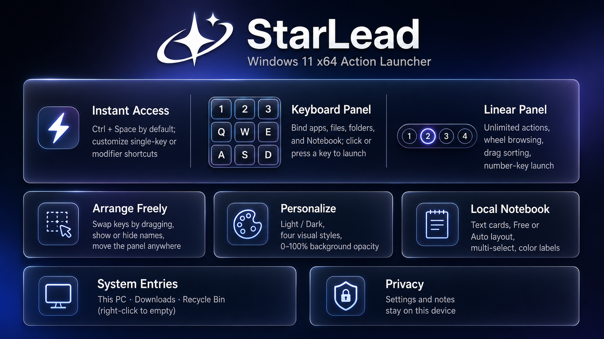

# StarLead (星引)



StarLead is a lightweight Windows 11 x64 action launcher with keyboard-shaped and linear panels.

📘 [English User Guide](docs/USER_GUIDE.en-US.md) · [中文用户手册](docs/USER_GUIDE.zh-CN.md)

## License

Source code is available under the [PolyForm Noncommercial License 1.0.0](LICENSE). Personal, educational, research, and other noncommercial use, modification, and distribution are permitted under its terms. Commercial use requires separate written permission; see [COMMERCIAL.md](COMMERCIAL.md). The StarLead / 星引 names and logo are covered by [TRADEMARKS.md](TRADEMARKS.md).

This is source-available software, not OSI-defined open-source software.

## Highlights

- Press `Ctrl + Space` by default to show or hide the active panel. The hotkey is configurable and can also be a single symbol key such as `` ` ``.
- Drag apps, files, or folders directly from Desktop or File Explorer onto a key.
- Click an icon or press its visible key/number to launch it.
- Reorder keyboard bindings and linear icons by dragging.
- Switch instantly between light/dark themes and Chinese/English.
- Choose Liquid Glass, Ocean Blue, Aurora, or Graphite; every style supports light and dark mode.
- Adjust panel opacity from `0–100%`; icons remain opaque, and at `0%` the outer border and shadow disappear.
- Optional Windows shell shortcuts for This PC, Downloads, and Recycle Bin.
- Built-in local text notebook with free/grid-snapped or automatic card layout.
- The notebook launcher behaves like every other action: move, swap, delete, or bind it again on any empty key. Keyboard and linear entries are independent.
- Settings and notes stay on this device in `%LOCALAPPDATA%\StarLead\data.json`.

## Build

Requirements: Windows 11 x64 and the [.NET 8 SDK](https://dotnet.microsoft.com/download/dotnet/8.0).

```powershell
dotnet build -c Release -p:Platform=x64
```

The Inno Setup installer definition is located at `installer/StarLead.iss`.

Chinese documentation: [README.md](README.md).
