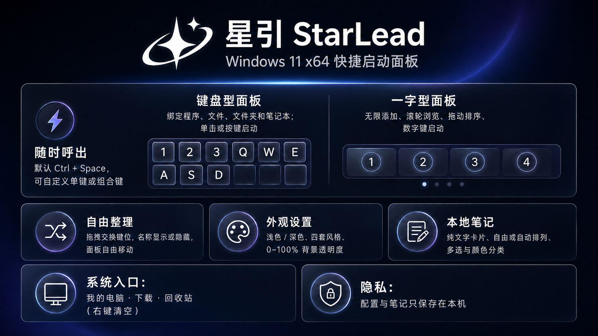

# 星引用户手册



> 适用于 StarLead（星引）v0.31，Windows 11 x64。

[English manual](USER_GUIDE.en-US.md) · [返回项目首页](../README.md)

## 1. 星引是什么

星引是一款只在本机运行的 Windows 快捷启动面板。你可以把常用程序、文件、文件夹和内置笔记本绑定到键位，通过全局快捷键随时呼出，再用鼠标或对应键位快速启动。

星引提供两种互相独立的面板：

- **键盘型**：按照 `1–0`、`Q–P`、`A–L`、`Z–M` 排列，适合形成键位记忆。
- **一字型**：横向排列任意数量的图标，适合滚轮浏览和鼠标选择。

所有设置、绑定和笔记默认只保存在你的电脑上。

## 2. 系统要求

- Windows 11 x64
- Intel 或 AMD x64 处理器
- 安装版无需另外安装 .NET

## 3. 安装、升级与卸载

### 安装

1. 从 GitHub Releases 下载最新的 `StarLead-Setup-x64-v*.exe`。
2. 双击安装包。
3. 根据需要选择是否创建桌面快捷方式。
4. 安装完成后启动“星引”。

### 升级

直接运行更高版本的安装包即可。安装程序会关闭旧进程并覆盖程序文件，不会删除 `%LOCALAPPDATA%\StarLead\data.json` 中的个人配置和笔记。

### 卸载

在 Windows 的“设置 → 应用 → 已安装的应用”中卸载星引。卸载程序不会主动删除本地数据文件；如需完全清除，请在退出星引后手动删除：

```text
%LOCALAPPDATA%\StarLead
```

## 4. 第一次使用

1. 默认按 `Ctrl + Space` 呼出星引。
2. 双击一个空键位。
3. 选择绑定程序、文件、文件夹或笔记本。
4. 之后单击图标，或在面板打开时按对应数字/字母，即可启动。
5. 按 `Esc` 或再次按呼出快捷键关闭面板。

也可以直接从桌面或文件资源管理器把程序、文件、文件夹拖到空键位。

## 5. 键盘型面板

### 启动动作

- 单击已绑定图标：启动目标。
- 面板打开时按图标右上角对应键位：启动目标。
- 拖动期间不会触发启动，避免整理时误开程序。

### 绑定动作

- 双击空键位，选择：
  - 绑定程序
  - 绑定文件
  - 绑定文件夹
  - 绑定笔记本
- 从桌面或文件资源管理器把项目直接拖到键位，也可立即绑定。

### 整理与删除

- 把一个键位拖到另一个键位即可交换绑定。
- 拖动过程中目标键位会高亮提示。
- 右键已绑定图标可打开、重新绑定或删除。
- 笔记本与其他动作相同，可以移动、交换、删除和重新绑定。

### 显示键位

在“设置 → 显示的键位”中可逐个隐藏键位。隐藏不会删除已有绑定，重新勾选后会恢复显示。

## 6. 一字型面板

### 添加与启动

- 把程序、文件或文件夹拖到面板空白处即可追加。
- 图标数量没有固定上限。
- 单击图标启动目标。
- 前十个动作可用数字键 `1–0` 启动。

### 浏览

- 滚动鼠标滚轮可在图标之间移动选择。
- 当前选择会高亮并平滑移动到可视区域。
- 鼠标经过图标时会自然放大，离开后恢复。

### 排序与删除

- 直接拖动图标可调整顺序。
- 右键图标可打开或删除。
- 笔记本也是普通的一字型动作，可自由排序或删除。

### 调整宽度和间距

- 靠近面板左右边缘并拖动，可直接调整整体长度。
- 在空白区域右键，可选择自适应宽度或自定义宽度。
- 图标间距可在右键菜单中实时调整。

## 7. Windows 系统入口

键盘型顶部可分别显示：

- 我的电脑
- 下载
- 回收站

这些入口可以在“设置 → 系统组件”中分别开关。

### 清空回收站

右键顶部的回收站图标，选择“清空回收站”。星引会调用 Windows 原生确认窗口；确认后才会清空，取消不会删除任何内容。

## 8. 笔记本

笔记本是一个可绑定到任意键位或一字型位置的普通动作。删除入口不会删除已经保存的笔记，再次绑定“笔记本”即可重新打开。

### 创建与编辑

- 双击笔记桌面的空白区域新建卡片。
- 双击卡片打开编辑窗口。
- 标题和正文会自动保存到本机。

### 选择与整理

- 单击卡片选中。
- `Ctrl + 单击`可以多选。
- 自由排列模式下，拖动卡片后会吸附到横平竖直的网格。
- 自动排列模式按“置顶优先、最近修改优先”整理。
- “一键整理”可立即重新排列全部卡片。

### 右键功能

- 编辑
- 复制文字
- 置顶 / 取消置顶
- 设置默认、黄、蓝、绿、粉、紫色
- 删除

对多张已选卡片设置颜色时，会同时应用到全部选中卡片。

## 9. 设置说明

### 语言

支持中文和 English，点击后立即切换并保存。

### 外观

- 浅色
- 深色

主题点击后立即生效。

### 界面风格

- 液态玻璃
- 海湾蓝
- 极光
- 石墨

四套风格均支持浅色和深色模式。

### 面板样式

键盘型与一字型完全独立。切换后会立即成为默认面板。

### 背景透明度

- 范围：`0–100%`
- 拖动或点击滑杆会实时预览。
- 点击轨道任意位置会直接跳转到对应数值。
- 图标不会随背景一起变透明。
- 设置为 `0%` 时，背景、外框和阴影都会消失。

### 一字型长度

可在设置中调整最大宽度，也可直接拖动一字型面板的左右边缘。

### 图标名称

可同时控制键盘型和一字型是否显示名称。关闭后，键位字母或顺序数字仍会显示。

### 呼出快捷键

默认是 `Ctrl + Space`。修饰键可以选择“无”，因此也可使用反引号 `` ` ``、`-`、`=`、`[`、`]` 等单个符号键。

如果快捷键被其他软件占用，请更换组合。

### 开机启动

勾选“登录 Windows 后自动启动星引”后，星引会随当前 Windows 用户登录启动。

### 面板位置

- 记住上次位置
- 每次居中

按住键帽、按钮和滑杆之外的空白区域即可移动面板。移动时会暂时关闭高成本阴影，释放后自动恢复。

## 10. 本地数据与隐私

数据文件位于：

```text
%LOCALAPPDATA%\StarLead\data.json
```

其中包括：

- 程序、文件和文件夹绑定
- 面板位置与外观设置
- 一字型图标顺序
- 本地笔记内容

星引当前不提供云同步，也不会主动上传上述数据。

### 备份

1. 从托盘图标退出星引。
2. 复制整个 `%LOCALAPPDATA%\StarLead` 文件夹。
3. 恢复时将备份复制回相同位置。

## 11. 常见问题

### 按快捷键没有反应

- 检查快捷键是否被其他软件占用。
- 在设置中更换快捷键并保存。
- 从系统托盘退出星引后重新启动。

### 图标不清晰

重新绑定原始 `.exe`、文件或文件夹。星引会从 Windows Shell 读取较高分辨率图标。

### 下载入口打开的位置不正确

星引读取 Windows 当前注册的“下载”已知文件夹位置，而不是固定使用 `C:\Users\用户名\Downloads`。可先在资源管理器中检查“下载”的位置设置。

### 删除笔记本入口后笔记是否还在

还在。删除的只是启动入口，不会删除笔记内容。双击空键位并选择“绑定笔记本”即可恢复入口。

### 右键菜单文字看不清

v0.31 起，应用字体统一使用“Microsoft YaHei UI / Segoe UI”回退链，右键菜单固定为白色背景和深色文字。若仍异常，请先退出旧进程，再安装最新版本。

## 12. 键鼠速查

| 操作 | 结果 |
|---|---|
| `Ctrl + Space` | 默认呼出 / 收起面板 |
| `Esc` | 关闭面板 |
| 单击已绑定图标 | 启动动作 |
| 双击空键位 | 新建绑定 |
| 拖动键位 / 图标 | 交换或排序 |
| 右键动作 | 打开、重新绑定或删除 |
| 面板打开时按对应键 | 启动对应动作 |
| 一字型中滚动滚轮 | 浏览并高亮图标 |
| 笔记桌面中 `Ctrl + 单击` | 多选笔记 |
| 右键顶部回收站 | 清空回收站 |

## 13. 获取帮助

提交 GitHub Issue 时，建议附上：

- 星引版本号
- Windows 版本
- 问题截图
- 复现步骤
- 是否使用浅色/深色及哪套界面风格
